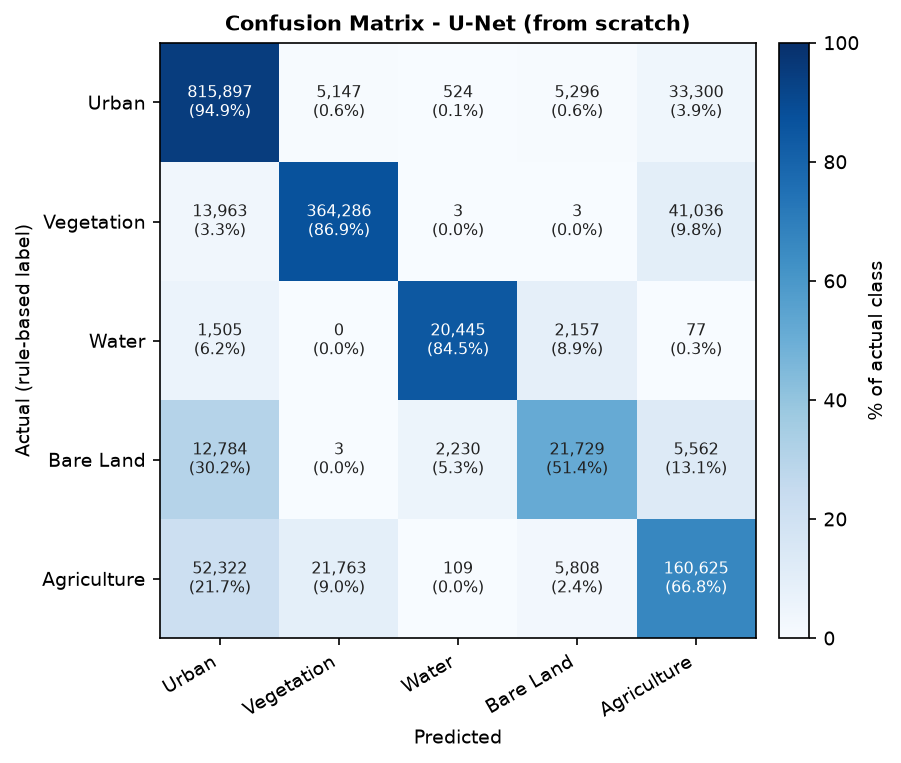

# GeoSense Agent 2.0

A geospatial site-intelligence system for **Kolkata, India**, built phase by phase:
machine learning on spatial features (Phase 1), deep learning on Sentinel-2 satellite imagery
(Phase 2), and — in later phases — LiDAR, an MCP agent and a web interface.

*Anubhav Ghosh · M.Tech Geoinformatics, Department of Geography, University of Madras*

| | |
|---|---|
| Study area | Kolkata bounding box 88.30–88.42 E, 22.45–22.67 N (≈ 12.6 × 24.5 km) |
| Metric CRS | EPSG:32645 (WGS 84 / UTM zone 45N) |
| Environment | conda `geosense`, Python 3.11, Windows 11, NVIDIA RTX 5060 Laptop GPU (8 GB) |

## Repository layout

```
src/phase1_ml/            Phase 1 — PostGIS ingestion, candidate grid, features, RF/XGBoost, site_scorer.py
src/phase2_dl/            Phase 2 — Sentinel-2 download, preprocessing, chips, labels, U-Net, Prithvi, evaluation, image_classifier.py
data/processed/           Phase 1 candidate grid, feature table and labelled dataset
data/satellite/clean/     Phase 2 composite metadata (the 400 MB of arrays are regenerated, not committed)
models/evaluation/        training histories, train/validation split, model comparison
outputs/reports/          Phase 1 label map and SHAP importance
outputs/plots/            Phase 2 confusion matrices, training curves, IoU comparison, prediction gallery
docs/                     data inventory, Phase 2 checklist with evidence, glossary application
tests/                    pytest unit tests
notebooks/                labelling notebook
```

Large artefacts are not committed: raw OSM/shapefile data, the Sentinel-2 composites, chips and
labels (`data/satellite/`, ≈ 400 MB) and the trained weights (`models/saved/*.pth`, 98 MB and 353 MB).
The scripts below regenerate all of them.

## Setup

```bash
conda create -n geosense python=3.11 && conda activate geosense
pip install torch torchvision torchaudio --index-url https://download.pytorch.org/whl/cu128   # or the /cpu index
pip install -r requirements.txt
earthengine authenticate
```

Create a `.env` in the project root (never committed):

```
DB_HOST=localhost  DB_PORT=5432  DB_NAME=geosense  DB_USER=postgres  DB_PASSWORD=...
STUDY_AREA=Kolkata
BBOX_MIN_LON=88.30  BBOX_MIN_LAT=22.45  BBOX_MAX_LON=88.42  BBOX_MAX_LAT=22.67
GEE_PROJECT=<your Google Cloud project id>
```

## Phase 1 — Site suitability from spatial features

OpenStreetMap layers for the Eastern Zone (roads, buildings, POIs, land use) were loaded into PostGIS,
a 0.005° candidate grid of 1,125 points was generated over the study area, and three features were
engineered in EPSG:32645 — distance to the nearest road, distance to the nearest hospital (point and
area POIs combined) and flood risk. A rule-labelled dataset (580 good / 545 poor sites) trained a
Random Forest and an XGBoost classifier on a stratified 900/225 split (accuracy 1.000 and 0.996 — the
labels are rule-derived, so this measures the models' ability to recover the rule, not real-world site
outcomes). The Random Forest was selected, explained with SHAP (`outputs/reports/shap_importance.png`:
hospital distance dominant, road distance second) and packaged as `src/phase1_ml/site_scorer.py`, which
scores any coordinate end-to-end; four pytest tests cover it.

```bash
python src/phase1_ml/load_osm_data.py && python src/phase1_ml/create_candidates.py
python src/phase1_ml/feature_engineering.py && python src/phase1_ml/train_model.py
python -m pytest tests/ -v
```

## Phase 2 — Deep learning on Sentinel-2 imagery

### Pipeline

| Step | Script | What it produces |
|---|---|---|
| 1 | `download_sentinel2.py` | cloud-free median composites (< 10 % cloud) for 2018 and 2023 from `COPERNICUS/S2_SR_HARMONIZED`, bands B2 B3 B4 B8 B11 B12, 10 m, EPSG:32645 (2448 × 1257 px), fetched in two strips to stay under the Earth Engine request limit |
| 2 | `preprocess_imagery.py` | cloud/nodata masking, reflectance 0–1, NDVI and NDWI rasters, metadata |
| 3 | `chip_images.py` | 224 × 224 × 6 chips, stride 174 → 78 per year, 156 in all |
| 4 | `generate_labels.py` | five-class pseudo-labels from NDVI / NDWI / NDBI thresholds calibrated to Kolkata (Urban, Vegetation, Water, Bare Land, Agriculture) |
| 5 | `train_unet.py` | U-Net (ResNet-34 encoder, 24.4 M parameters) trained from scratch, 50 epochs |
| 6 | `finetune_prithvi.py` | NASA–IBM **Prithvi-EO-1.0-100M** fine-tuned with blocks 0–9 frozen (19 % of 89 M parameters trained), documented ResNet-50/ImageNet fallback |
| 7 | `evaluate_models.py` | IoU, confusion matrices, classification reports and curves for both models on the same 32 held-out chips |
| 8 | `image_classifier.py` | `classify_imagery(lat, lon, radius_m)` — land cover, confidence, NDVI/NDWI, class distribution, 2018→2023 change flag |

```bash
python src/phase2_dl/download_sentinel2.py && python src/phase2_dl/preprocess_imagery.py
python src/phase2_dl/chip_images.py && python src/phase2_dl/generate_labels.py
python src/phase2_dl/train_unet.py
python src/phase2_dl/finetune_prithvi.py        # --check downloads and inspects the model only
python src/phase2_dl/evaluate_models.py
python src/phase2_dl/image_classifier.py        # seven test locations; --hotspots for change detection
```

### Results (32 held-out chips, 1,586,574 labelled pixels)

| Metric | U-Net (ResNet-34, from scratch) | Prithvi-100M (fine-tuned) |
|---|---|---|
| Pixel accuracy | **87.17 %** | 76.11 % |
| Mean IoU (5 classes) | **66.63 %** | 44.66 % |
| Macro F1 | 78.37 % | 54.94 % |
| IoU — Urban / Vegetation / Water | 86.7 / 81.6 / 75.6 % | 74.0 / 65.6 / 67.0 % |
| IoU — Bare Land / Agriculture | 39.1 / 50.1 % | 3.8 / 13.0 % |
| Trainable parameters | 24,446,357 | 16,906,469 of 88,966,373 |
| Training (RTX 5060) | 50 epochs, 79 s | 40 epochs, 140 s |
| Inference per 224 × 224 chip | 2.1 ms | 6.4 ms |



The from-scratch U-Net is the stronger model on this task: the labels are per-pixel spectral rules at
10 m, which the U-Net's skip connections can reproduce almost exactly, whereas the foundation model
summarises each 16 × 16-pixel patch into one token and smooths away the two thin, threshold-defined
classes. `image_classifier.py` therefore loads the U-Net by default (`GEOSENSE_MODEL=prithvi` switches
to the fine-tuned model). Full analysis: `outputs/model_comparison.md`.

Spectral indices over the study area — NDVI mean **0.281 (2018)** and **0.284 (2023)**; NDWI mean
−0.299 and −0.294; 97.8 % of the area cloud-free in both composites.

### image_classifier.py

```python
from src.phase2_dl.image_classifier import classify_imagery
classify_imagery(22.5570, 88.3460, radius_m=500)      # the Maidan, central Kolkata
```

```text
Loaded model: U-Net ResNet-34 (unet_best.pth) on cuda
  land_cover          : Vegetation          class_id : 1        confidence_pct : 85.6
  ndvi                : 0.458   ndwi : -0.458   ndvi_label : Moderate healthy vegetation
  class_distribution  : {'Urban': 23.5, 'Vegetation': 67.3, 'Water': 0.1, 'Bare Land': 0.6, 'Agriculture': 8.5}
  ndvi_baseline (2018): 0.435   ndvi_change : +0.023   changed_pixel_pct : 3.1
  change_flag         : False
  change_description  : No significant change detected 2018->2023 (mean NDVI +0.435 -> +0.458, ...)
  inference_time_s    : 0.591   (first call, includes CUDA warm-up; later calls 0.04-0.07 s)
```

| Test location (radius 500 m) | Land cover | Distribution U / V / W / B / A (%) | NDVI 2023 | ΔNDVI 2018→2023 | Change |
|---|---|---|---|---|---|
| Maidan, 22.557 N 88.346 E | Vegetation | 23.5 / 67.3 / 0.1 / 0.6 / 8.5 | 0.458 | +0.023 | no |
| B.B.D. Bagh (CBD), 22.571 N 88.348 E | Urban | 56.5 / 15.7 / 3.4 / 7.5 / 16.9 | 0.223 | +0.019 | no |
| Hooghly off Howrah, 22.590 N 88.344 E | Urban (river bank) | 38.7 / 17.2 / 27.7 / 3.9 / 12.5 | 0.109 | +0.001 | no |
| East Kolkata Wetlands, 22.547 N 88.415 E | Vegetation | 4.6 / 64.0 / 0.0 / 20.7 / 10.7 | 0.432 | +0.027 | no |
| Garden Reach / port, 22.537 N 88.311 E | Urban | 46.5 / 21.0 / 15.0 / 1.4 / 16.2 | 0.229 | +0.005 | no |

Change detection compares the NDVI of the same window in the 2018 and 2023 composites and raises
`change_flag` when the mean inside the radius moves by more than 0.15;
`python src/phase2_dl/image_classifier.py --hotspots` ranks every 500 m block of the study area by NDVI
change and classifies the strongest loss and gain.

```text
$ python src/phase2_dl/image_classifier.py --hotspots
Largest NDVI loss 2018->2023 (500 m blocks):   lat 22.6462, lon 88.3022: mean NDVI change -0.167
Largest NDVI gain 2018->2023 (500 m blocks):   lat 22.5189, lon 88.4079: mean NDVI change +0.270

NDVI gain hotspot - classify_imagery(22.5189, 88.4079, radius_m=500)
  land_cover          : Vegetation   (65.0 % Vegetation, 16.1 % Agriculture, 9.5 % Urban, 9.3 % Bare Land)
  ndvi                : 0.515        ndvi_baseline : 0.351     ndvi_change : +0.164
  changed_pixel_pct   : 44.9
  change_flag         : True
  change_description  : Significant land change detected 2018->2023: vegetation gain,
                        mean NDVI +0.351 -> +0.515 (45% of pixels changed by more than 0.15)
```

```text
$ python src/phase2_dl/image_classifier.py --lat 22.6462 --lon 88.3022 --radius 250
  land_cover          : Urban        (52.2 % Urban, 34.4 % Vegetation, 12.2 % Agriculture, 1.1 % Bare Land)
  ndvi                : 0.304        ndvi_baseline : 0.495     ndvi_change : -0.192
  changed_pixel_pct   : 48.9
  change_flag         : True
  change_description  : Significant land change detected 2018->2023: vegetation loss,
                        mean NDVI +0.495 -> +0.304 (49% of pixels changed by more than 0.15)
```

The gain hotspot lies in the East Kolkata Wetlands east of the E.M. Bypass; the loss hotspot is at the
north-west corner of the area on the Howrah side of the Hooghly, where vegetated land has become
built-up. Stable locations (the Maidan, the business district, the river) return `change_flag: False`
with NDVI changes of 0.03 or less.

More: `docs/phase2_checklist.md` (deliverables with evidence), `docs/phase2_glossary_application.md`.

## Licence and data

Code © Anubhav Ghosh 2026, for academic use. OpenStreetMap data © OpenStreetMap contributors (ODbL);
Sentinel-2 imagery © ESA/Copernicus via Google Earth Engine; Prithvi-EO-1.0-100M © IBM/NASA
(HuggingFace, `ibm-nasa-geospatial/Prithvi-EO-1.0-100M`).
